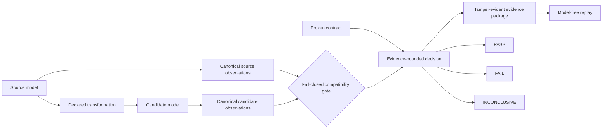

# Neural Continuity

<p align="center">
  
</p>

<p align="center">
  
  
  
  
  
  
  
</p>

<p align="center">
  <a href="#why-this-project-exists">Why</a> ·
  <a href="#how-it-works">Workflow</a> ·
  <a href="#current-evidence">Evidence</a> ·
  <a href="#diagnostic-snapshot">Diagnostics</a> ·
  <a href="#quick-start">Quick start</a> ·
  <a href="#documentation-map">Documentation</a>
</p>

**Evidence-driven research framework for testing whether model transformations preserve declared operational behavior.**

Neural Continuity evaluates a declared transition between a source model and a candidate. It freezes the contract before evaluation, measures both sides under compatible conditions, packages tamper-evident evidence, and supports replay without rerunning the models.

Qualifying evidence produces one of three scientific decisions:

- `PASS`
- `FAIL`
- `INCONCLUSIVE`

Missing prerequisites and execution failures are kept separate as `BLOCKED` and `EXECUTION_ERROR`.

> **A model can execute correctly and still fail continuity.**

That distinction is central to the project. Successful export, conversion, quantization, or runtime execution is not treated as proof that the transformed model still behaves within the declared contract.

## Why this project exists

Model transformations can preserve executability while changing representations, rankings, or application-level behavior. Neural Continuity asks a deliberately narrow question:

> **Did this declared transition preserve the operational properties frozen before evaluation, inside the evidence envelope actually measured?**

It does not certify universal model equivalence, infer behavior outside the observed experiment, or allow a candidate to redefine tolerances after its results are known.

## What Neural Continuity measures

The framework separates model execution from evidence about preserved behavior.

Current measurement and evidence machinery covers:

- frozen functional requirements and regression limits;
- embedding and representation drift;
- retrieval and ranking preservation;
- measured noise envelopes and repeatability;
- source / candidate identity and compatibility checks;
- deterministic evidence packaging with SHA-256 manifests;
- model-free replay of recorded decisions.

Experiments are evaluated against predeclared contracts. A candidate does not get to redefine its own baseline, tolerances, or acceptance criteria after the result is known.

## How it works



The compatibility gate checks identities and semantics before comparison. Declared missing artifacts, incompatible observation packages, or integrity failures do not get silently repaired.

| Layer | Question | Outcomes |
|---|---|---|
| Technical execution | Did the pipeline run as declared? | valid execution or `EXECUTION_ERROR` |
| Evidence integrity | Are prerequisites complete, compatible, and hash-verified? | valid evidence or `BLOCKED` |
| Scientific decision | Did behavior remain inside the frozen operational boundary? | `PASS`, `FAIL`, `INCONCLUSIVE` |
| Replay | Can the result be reconstructed from recorded evidence? | match or fail-closed mismatch |

## Current evidence

| Milestone | Transition / purpose | Result |
|---|---|---|
| **M0** | Measurement integrity | **PASS / replay-verified** |
| **M1-A** | `PyTorch FP32 → ONNX FP32` | **PASS** under the frozen contract |
| **M1-B** | `ONNX FP32 → static-QDQ ONNX INT8` | **FAIL** under the frozen contract |

### M0 — measurement integrity

M0 establishes the trust boundary for the measurement system. It verifies that the framework can distinguish:

1. normal variation from repeated observation of the same frozen model;
2. deliberate material degradation;
3. a boundary condition where the evidence remains `INCONCLUSIVE`.

Replay reconstructs the recorded aggregate decision and individual control outcomes without rerunning the original model execution.

### M1-A — FP32 export continuity

Transition A evaluates `PyTorch FP32 → ONNX FP32` separately from quantization so export/runtime effects are not conflated with quantization effects.

The transition passed under its frozen contract.

See [M1 Transition A evidence](docs/M1_TRANSITION_A_EVIDENCE.md).

### M1-B — INT8 candidate failure

Transition B evaluated one frozen static-QDQ ONNX INT8 candidate against the replay-verified ONNX FP32 source.

The technical pipeline completed successfully, measurement integrity remained valid, and model-free replay reproduced the recorded decision. The scientific result was nevertheless **`FAIL`** because the candidate exceeded the inherited functional limits across all required batch sizes (`1`, `16`, `64`) and materially degraded decision-bearing retrieval metrics.

This is exactly the separation Neural Continuity is intended to enforce:

```text
technical execution     PASS
measurement integrity   VALID
model-free replay       PASS
continuity decision     FAIL
```

The failed candidate remains frozen. It is not regenerated, retuned, or re-evaluated by changing thresholds inside the same evidence slice. A new attempt requires a separately versioned contract, candidate identity, and experiment.

See:

- [M1 Transition B decision](docs/M1_TRANSITION_B_DECISION.md)
- [M1 Transition B postmortem](docs/M1_TRANSITION_B_POSTMORTEM.md)
- [M1 v1 evidence archive](docs/M1_EVIDENCE_ARCHIVE.md)

## Current research frontier

Transition B remains scientifically frozen as <code>FAIL</code>. Structural localization is complete; the current slice pre-registers controls, single-family precision holdouts, and pairwise follow-ups before any diagnostic candidate can be created.

Every cluster remains in scope. Detection limits must come from verified measurement authority, operational tolerances remain frozen, and no intervention is authorized by the planning package.
## Diagnostic snapshot

| Signal | Verified snapshot |
|---|---|
| Paired probes | 283 floating probes; 248 with integer-domain proxies |
| Probe outcomes | 52 bitwise equal; 219 finite drift; 12 non-finite |
| First divergence | <code>probe-0001</code> |
| Highest finite-cluster peak | <code>probe-0181</code> - attention/matmul + normalization + output aggregation + quantized compute |
| Structural localization | 64 clusters: 58 finite and 6 non-finite |
| Causal status | Hypotheses pre-registered; interventions not authorized |

~~~mermaid
flowchart LR
    A[Verified activation package] --> B[Model-free probe analysis]
    B --> C[Deterministic structural clusters]
    C --> D[Tamper-evident report and replay]
~~~

The observed Pearson association between relative L2 error and the integer dtype-extreme proxy is <code>-0.3205</code>. It is descriptive, non-causal, and does not support a saturation-only explanation.
## Why this is continuity

Model transformations can preserve executability while changing behavior that matters to the application. Neural Continuity asks a narrower and testable question:

> **Did this declared transition preserve the operational properties we froze before evaluation, inside the evidence envelope we actually measured?**

The framework therefore compares declared experiments and evidence against measured envelopes rather than treating conversion success, numerical closeness, or a single benchmark score as automatic equivalence.

## Meaning of decisions

Scientific decisions:

- `PASS`: complete, valid evidence satisfies every applicable frozen operational tolerance.
- `FAIL`: complete, valid evidence demonstrates at least one applicable frozen operational-tolerance violation.
- `INCONCLUSIVE`: complete evidence intersects a decision boundary or does not justify either `PASS` or `FAIL`.

Technical outcomes:

- `BLOCKED`: a declared prerequisite, artifact, observation, compatibility condition, or integrity check is missing or invalid.
- `EXECUTION_ERROR`: export, runtime, provider, preprocessing, or another technical operation fails; this is not recorded as a scientific regression.

## Quick start

### Smoke experiment

```bash
python -m venv .venv
. .venv/Scripts/Activate.ps1  # Windows PowerShell
pip install -e ".[dev,test]"
python -m pytest -q
ruff check .
python -m black --check --workers 1 -- src tests
python -m mypy src
python -m compileall -q src tests
python -m neural_continuity.cli m0-run --config experiments/m0-smoke.yaml
```

If dependencies and model access are available, run:

```bash
python -m neural_continuity.cli m0-run --config experiments/m0-real-teacher.yaml
```

Real teacher execution may be skipped automatically when the model is not available offline.

## Reproducibility and evidence

Neural Continuity treats the evidence package as part of the experiment rather than an afterthought.

The repository includes:

- deterministic local toy models and fixtures for offline tests;
- canonical JSON serialization with sorted keys and UTF-8;
- stable fixture identities;
- SHA-256 artifact manifests;
- frozen experiment contracts;
- compatibility checks between source and candidate observations;
- replay paths that reproduce decisions from recorded evidence without rerunning the models.

M1 v1 also records a tamper-evident inventory for its authoritative evidence packages. Tamper-evident does not mean physically immutable, and remote redundancy is not currently claimed as verified.

## Repository map

| Path | Responsibility |
|---|---|
| `src/neural_continuity/` | Measurement, evidence, decision, replay, and transition-specific implementation |
| `contracts/` | Single authority for frozen transition contracts |
| `experiments/` | Declared experiment configurations and smoke fixtures |
| `tests/` | Offline, fail-closed, replay, and integrity verification |
| `docs/` | Research plans, evidence reports, postmortems, and diagnostic protocols |
| `runs/` | Generated local run packages; not a substitute for authoritative archived evidence |

## Documentation map

- [M1 research guide](M1_RESEARCH_GUIDE.md)
- [M1 action plan](docs/M1_ACTION_PLAN.md)
- [Transition A evidence](docs/M1_TRANSITION_A_EVIDENCE.md)
- [Transition B decision](docs/M1_TRANSITION_B_DECISION.md)
- [Transition B postmortem](docs/M1_TRANSITION_B_POSTMORTEM.md)
- [M1 v1 evidence archive](docs/M1_EVIDENCE_ARCHIVE.md)
- [Transition B v2 diagnostic protocol](docs/M1_TRANSITION_B_V2_DIAGNOSTIC_PROTOCOL.md)

## Repository outputs

A measurement run can produce `runs/<run-id>/` artifacts including:

- `model-manifest.json`
- `dataset-manifest.json`
- `environment-manifest.json`
- `experiment-config.json`
- `raw-observations.parquet`
- `metrics.json`
- `noise-envelope.json`
- `comparison-report.json`
- `decision.json`
- `artifact-manifest.json`

## Claim boundary

Neural Continuity measures continuity only inside declared experiments, frozen contracts, observed datasets, and measured uncertainty.

It produces evidence-bounded continuity decisions. It does **not** certify universal equivalence, physical immutability of evidence, or correctness outside the declared experimental boundary.

## Repository topics

`machine-learning` · `model-evaluation` · `model-quantization` · `onnx` · `reproducible-research` · `mlops` · `retrieval` · `evidence-integrity` · `scientific-computing`

## Current diagnostic gate

<!-- m1-stage0-status -->
| Control | Outcome | Evidence |
|---|---|---|
| FP32 canonical repeat | `BLOCKED` | Rankings are stable; numerical drift exceeds the frozen repeated-inference envelope. |
| INT8 canonical repeat | `BLOCKED` | Embedding and ranking drift exceed the frozen repeated-inference envelope. |
| Runtime provenance | `INCONCLUSIVE` | The frozen batch-size envelope does not cover canonical baseline variation. |
| Measurement-null extension | `PREREGISTERED` | 120 process epochs and 960 source-only passes are frozen; execution has not started. |
| Sentinel executor | `IMPLEMENTED, NOT EXECUTED` | Authority-first, one epoch per process, hash-chained resume; full-corpus execution remains unavailable. |
| Stage 1 | `NOT STARTED` | The fail-closed gate holds; Transition B remains `FAIL`. |

Stage 0, runtime-provenance, and measurement-null-plan replay are model-free and verified. No threshold or frozen evidence was changed.
<!-- /m1-stage0-status -->
